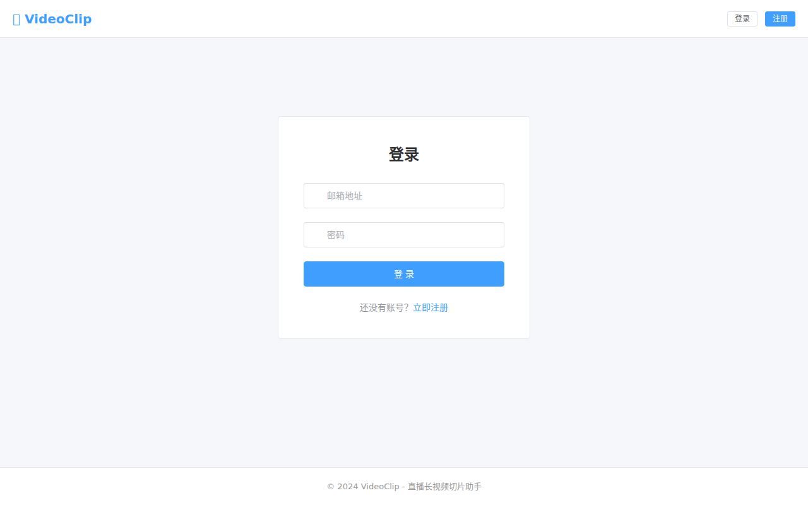
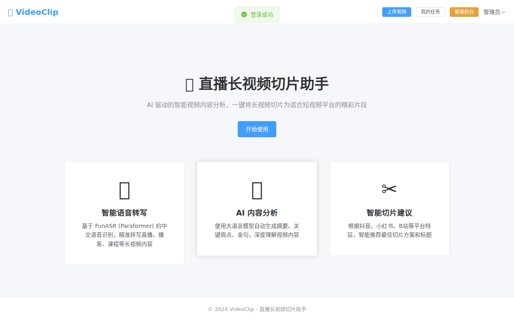
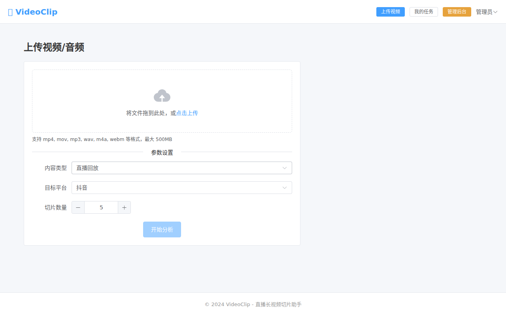
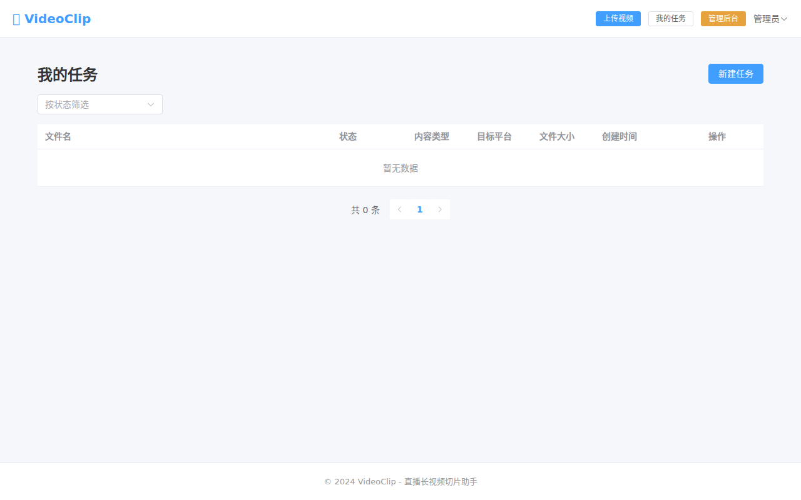
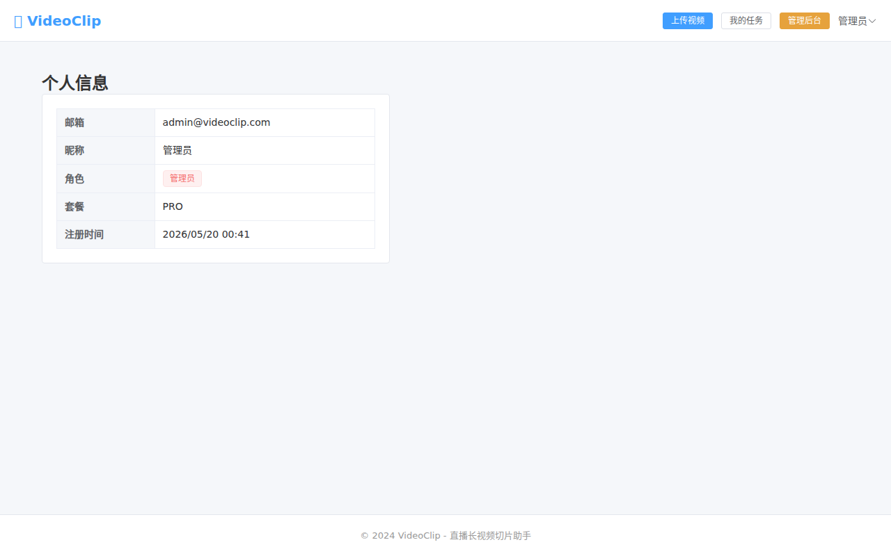
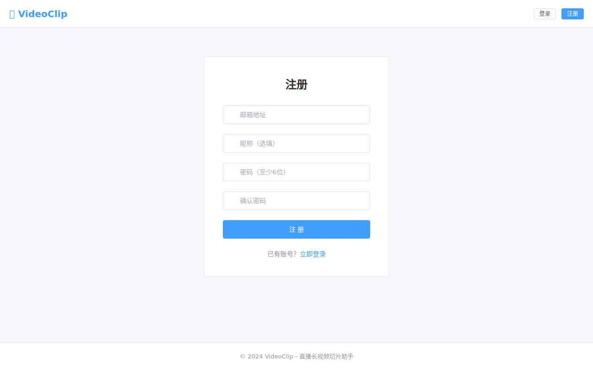
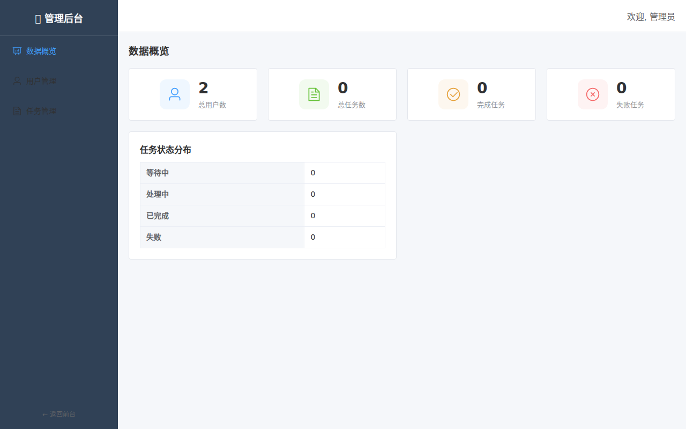
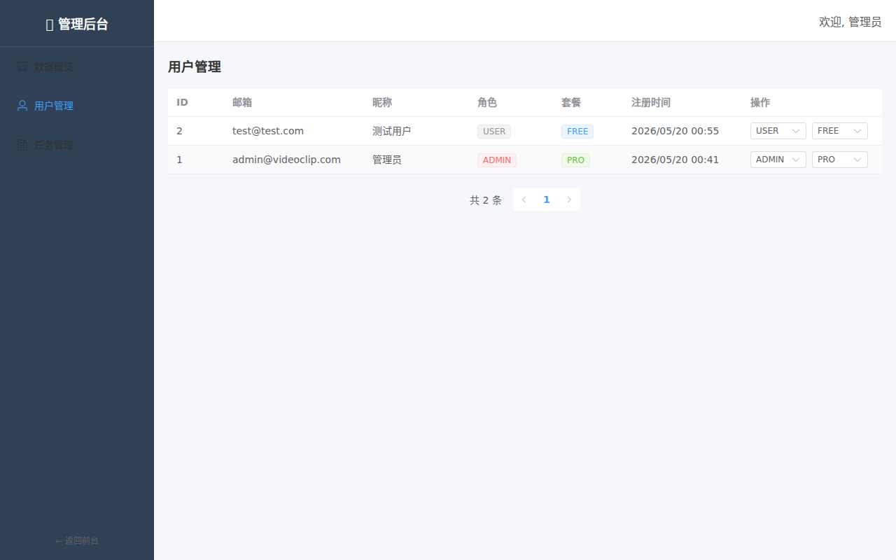
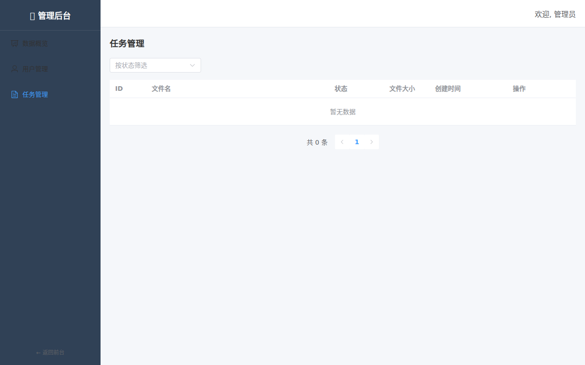

# VideoClip Platform - 直播长视频切片助手

基于 AI 的视频内容分析工具，自动将直播回放、长视频、播客等内容切片为适合短视频平台发布的片段。

> **前端后端分离架构**：Spring Boot 3.3 + Vue 3 + MySQL
> 📖 **[部署启动手册](DEPLOY.md)**



## 技术栈

| 层级 | 技术 |
|------|------|
| 后端框架 | Spring Boot 3.3 + Java 17 |
| 数据访问 | MyBatis-Plus 3.5 |
| 数据库 | MySQL 8.0 |
| 认证 | Spring Security + JWT |
| API 文档 | SpringDoc OpenAPI (Swagger) |
| 前端框架 | Vue 3 + TypeScript |
| 构建工具 | Vite 6 |
| UI 组件 | Element Plus |
| 状态管理 | Pinia |
| 语音识别 | FunASR (Paraformer) |
| AI 分析 | DeepSeek / OpenAI 兼容 API |

## 项目结构

```
video-clip-platform/
├── backend/                     # Spring Boot 后端
│   ├── pom.xml
│   ├── scripts/
│   │   └── transcribe.py       # FunASR 转写脚本
│   └── src/main/
│       ├── java/com/clip/platform/
│       │   ├── config/          # Spring 配置
│       │   ├── common/          # 统一响应、异常处理
│       │   ├── security/        # JWT、Spring Security
│       │   ├── entity/          # 数据实体
│       │   ├── mapper/          # MyBatis-Plus Mapper
│       │   ├── dto/             # 请求/响应 DTO
│       │   ├── service/         # 业务逻辑
│       │   ├── controller/      # REST API
│       │   └── runner/          # 启动初始化
│       └── resources/
│           ├── application.yml
│           └── db/migration/    # SQL 迁移脚本
│
├── frontend/                    # Vue 3 前端
│   ├── package.json
│   ├── vite.config.ts
│   └── src/
│       ├── api/                 # API 调用
│       ├── components/          # 公共组件
│       ├── layouts/             # 布局
│       ├── router/              # 路由
│       ├── stores/              # Pinia 状态
│       ├── types/               # TypeScript 类型
│       ├── utils/               # 工具函数
│       └── views/               # 页面
│
├── docker-compose.yml           # MySQL 容器
└── README.md
```

## 快速开始

### 1. 启动 MySQL

```bash
docker-compose up -d
```

### 2. 启动后端

```bash
cd backend

# 配置环境变量（可选，已有默认值）
export DB_URL="jdbc:mysql://localhost:3306/video_clip?useSSL=false&serverTimezone=Asia/Shanghai&allowPublicKeyRetrieval=true&characterEncoding=utf8mb4"
export DB_USER="root"
export DB_PASS="root"
export LLM_API_KEY="sk-your-api-key"
export LLM_BASE_URL="https://api.deepseek.com/v1"
export LLM_MODEL="deepseek-chat"

# 运行
mvn spring-boot:run
```

后端启动在 http://localhost:8080

Swagger 文档：http://localhost:8080/swagger-ui.html

### 3. 启动前端

```bash
cd frontend
npm install
npm run dev
```

前端启动在 http://localhost:5173

### 4. 默认管理员账号

- 邮箱: `admin@videoclip.com`
- 密码: `admin123456`

## 功能说明

### 用户端

#### 首页



#### 上传视频



支持 mp4/mov/mp3/wav/m4a/webm 等格式，最大 500MB。

#### 任务列表



查看任务列表和状态，支持按状态筛选。

#### 个人中心



**其他功能：**
- **注册/登录** - 邮箱注册，JWT 认证
  
- **转写查看** - 查看语音转写文本，带时间码
- **AI 分析** - 查看摘要、关键观点、金句
- **切片建议** - 查看 AI 推荐的切片方案（时间段、标题、评分）
- **字幕导出** - 支持导出 SRT 和 TXT 格式

### 管理后台

#### Dashboard



#### 用户管理



#### 任务管理



**功能：**
- **数据概览** - 用户数、任务数统计
- **用户管理** - 用户列表、修改角色/套餐
- **任务管理** - 所有任务列表、失败任务重试

---

## v2.0 新增功能

### ✂️ 自动视频切片

分析完成后，点击「裁剪视频」按钮，FFmpeg 自动按切片建议裁剪原始视频，支持：
- 单个切片裁剪
- 一键批量裁剪所有切片
- 裁剪完成后直接下载

### 🎬 视频预览播放器

任务详情页内嵌 HTML5 视频播放器：
- 点击转写文本的任意时间码，视频自动跳转到对应位置
- 点击切片建议的时间段，视频跳转到切片开始处预览

### 📦 批量上传

上传页面支持多文件同时上传：
- 拖拽多文件到上传区域
- 上传队列实时显示进度
- 所有文件使用相同的参数设置

### 🐳 Docker 一键部署

```bash
docker compose up -d
```

自动启动：MySQL + Redis + Spring Boot 后端 + Nginx 前端

### 🔄 CI/CD

推送到 main 分支自动触发 GitHub Actions：
- 后端 Maven 编译
- 前端 TypeScript 类型检查 + Vite 构建
- Docker 镜像构建验证

## API 接口

| 方法 | 路径 | 说明 |
|------|------|------|
| POST | /api/auth/register | 注册 |
| POST | /api/auth/login | 登录 |
| GET | /api/auth/me | 当前用户 |
| POST | /api/tasks | 创建任务 |
| GET | /api/tasks | 任务列表 |
| GET | /api/tasks/{id} | 任务详情 |
| GET | /api/tasks/{id}/export/srt | 导出 SRT |
| GET | /api/tasks/{id}/export/txt | 导出 TXT |
| GET | /api/admin/stats | 统计数据 |
| GET | /api/admin/users | 用户列表 |
| PUT | /api/admin/users/{id} | 更新用户 |
| GET | /api/admin/tasks | 所有任务 |
| PUT | /api/admin/tasks/{id}/retry | 重试任务 |

## 许可证

MIT License
